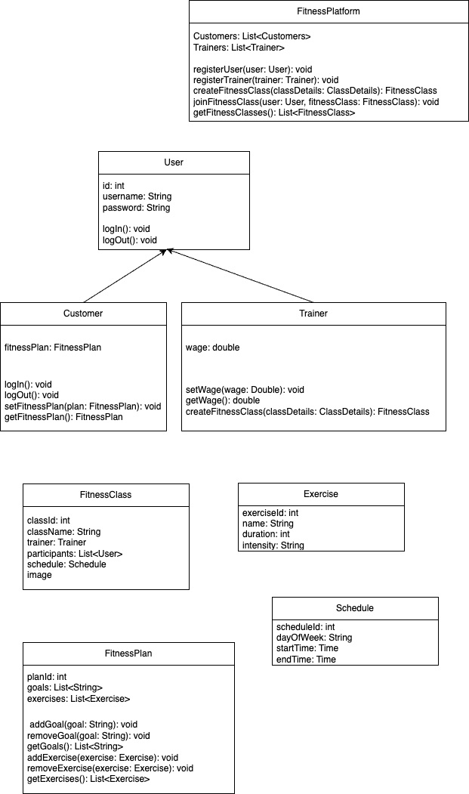

# Welcome to the course CSYE6200 - Object Oriented Design
> Northeastern University, College of Engineering

## Professor: Daniel Peters
## Project Name: FitFusion
Virtual Health and Fitness Platform

A comprehensive virtual health and fitness platform that brings together fitness enthusiasts, trainers, and health-conscious individuals in a dynamic and interactive online environment.
### UML

### Tech Stack
1. Java using SpringBoot for Backend
2. ReactJS App for frontend(nodeJS required)
3. MySQL database

### SetUp Instructions
1. Please clone the repository on your local system
2. Install and start mySQL server on your local machine and run all the scripts in backend/src
3. In resources-> application.properties update your local database password
3. For IntelliJ you can just run a springBoot application.
4. For frontend open frontend folder, run npm i and run npm start

### API Documentation
1. POST `/api/upload-csv`: Upload a csv file to showcase file exception handling
2. GET `/api/exercises`: Endpoint to get all the exercises from the MySQL database.
3. GET `/api/exercises/sortByDuration`: Endpoint to get all the exercise sorted by duration (Stream implementation).
4. GET `/api/exercises/sortByName`: Endpoint to get all the exercise sorted by duration (Stream implementation).
5. GET `/api/fitnessClasses`: Endpoint to get all fitness classes
6. GET `/api/fitnessClasses/sorted`: Endpoint to get all fitness classes sorted in by className

### API Responses
- Status Code 200: Successful
- Status Code 404: Resource Not Found - The requested resource was not found.
- Status Code 500: Internal Server Error - An unexpected error occurred.